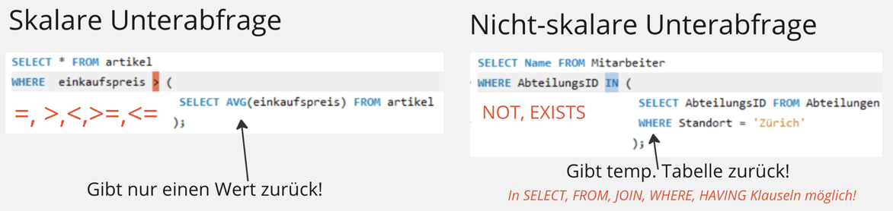
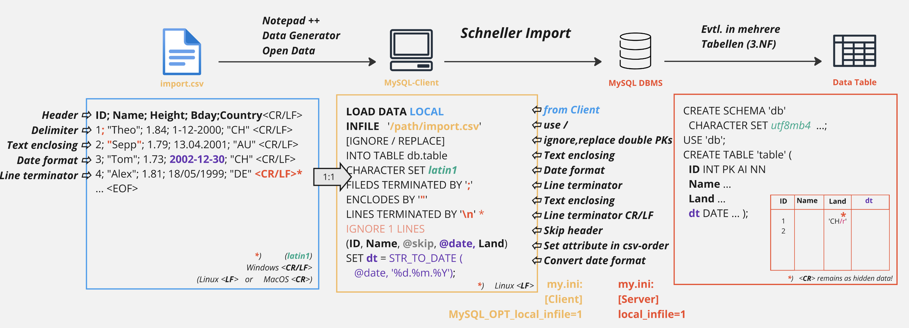

# subselect

ein subselect ist eine Abfrage innerhalb einer anderen Abfrage die eine andere Tabelle betrifft.

beispiel:

```
select *
FROM kunden
WHERE fk_ort_postleitzahl IN ( select id_postleitzahl FROM orte WHERE name = 'München');
```

- Das subselect ist immer in Klammern einzuschliessen.
- Achten Sie auf den Operator, mit dem Sie das Ergebnis der Unterabfrage vergleichen: (skalar oder nicht-skalar)
  

## Skalare Unterabfrage

- Eine skalare Unterabfrage gibt nur eine Spalte mit nur einer Zeile zurück.
- Wenn man bestimmte operatoren verwendet muss die abfrage Skalar sein. (=, >, >=, < und <=)
- Beispiel:

```
SELECT city_destination, ticket_price, travel_time, transportation FROM one_way_ticket
  WHERE ticket_price < (
      SELECT MIN(ticket_price) FROM one_way_ticket
      WHERE city_destination = 'Bariloche' AND city_origin = 'Paris'
      )
  AND city_origin = 'Paris';

```

- Ergebniss:
  | City_Destination | Ticket_Price | Travel_Time | Transportation |
  | :--- | :--- | :--- | :--- |
  | Bariloche | 830.00 | 11hr 30min | air |

## Nicht-skalare Unterabfrage

- Beispiel:

```
SELECT name, age, country
FROM users
WHERE country IN
(  -- hier beginnt Subquery:
   SELECT name FROM country WHERE region = 'Europa'
)

```

- In diesem Beispiel werden die Namen und Altersangaben von Benutzern aus der Tabelle users abgerufen, die in europäischen Ländern leben.

## Hauptunterschied

- Bei einer skalaren unterabfrage bekommt man nur eine einzige zeile zurück.

# Bulk Import



## CSV Datei vom Server laden

- Das Kommando dazu heisst:

```
LOAD DATA INFILE "C:/path/import.csv"
```

- Mit diesem Kommando, versucht der MariaDB Server, die Eingabedatei aus seinem eigenen Dateisystem zu lesen. Ohne Pfadangabe sucht der Server die Datei im Data-Verzeichnis der aktuellen Datenbasis

## CSV-Datei vom Client laden

- Das Kommando dazu heisst:
```
LOAD DATA LOCAL INFILE "C:/path/import.csv"
```
- Beachten Sie den Zusatz LOCAL! Wenn Sie diese Anweisung ausführen, versucht der Klient, die Eingabedatei aus seinem Dateisystem zu lesen, und sendet den Inhalt der Eingabedatei an den MariaDB Server. Auf diese Weise können Sie Dateien aus dem lokalen Dateisystem des Klienten in die Datenbank laden.


