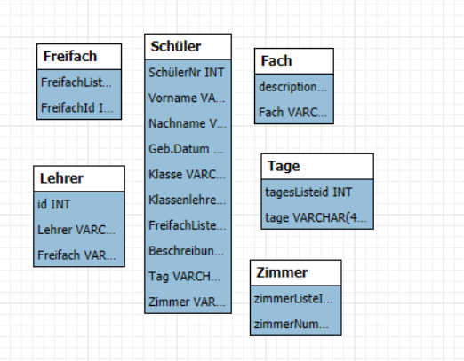

# Erstellen Sie die erste Normalform der EXCEL-Tabelle und exportieren Sie die Daten als CSV-Dateien. (Atomare Felder, Redundanz wird bewusst erzeugt).

## LehrerTabelle

LehrerVorname;LehrerNachname;Geb.Tag;Geb.Monat;Geb.Jahr;Freifach
Theo;Lempel;12.05.1984;5;1984;Mathe
Breier ;Guido;21.06.1987;6;1987;Elektronik
Lempel ;Theo;14.11.1978;11;1978;Chor
Sommer ;Inge;10.02.1977;2;1977;
Breier ;Guido;11.05.1984;5;1784;Tanz
Sommer;Inge;02.10.1979;10;1979;Politik
Klausen;Franz;;;;Rhythmik
;;;;;

## SchülerTabelle

Freifächer (Auszug);;;;;;;;;;;;;;;;;;;;;;;;;;;;;;;;;;;;;;;;;;;;;;;;;;;;;;;;;;;;;;;;;;;;;;;;;;;;;;;;;;;;;;;;;;;;;;;;;;;;
;;;;;;;;;;;;;;;;;;;;;;;;;;;;;;;;;;;;;;;;;;;;;;;;;;;;;;;;;;;;;;;;;;;;;;;;;;;;;;;;;;;;;;;;;;;;;;;;;;;;http://www.tinohempel.de/info/info/datenbank/normalisierung.htm
SchülerNr;Vorname;Nachname;Geb.Tag;Geb.Monat;Geb.Jahr;KlasenBuchstabe;KlassenZahl;LehrerVorname;LehrerNachname;FreifachNr;FriefachNr1;FreifachNr2;Beschreibung;Beschreibung1;Beschreibung2;Tag;Tag1;Tag2;Zimmer;Zimmer1;Zimmer2;;;;;;;;;;;;;;;;;;;;;;;;;;;;;;;;;;;;;;;;;;;;;;;;;;;;;;;;;;;;;;;;;;;;;;;;;;;;;;;
1;Jürgens;Ulla;6;5;2003;a;11; Theo;Lempel;2;;;Tanz;;;Mo;;;112;;;;;;;;;;;;;;;;;;;;;;;;;;;;;;;;;;;;;;;;;;;;;;;;;;;;;;;;;;;;;;;;;;;;;;;;;;;;;;;;;
2;Schmidt;Harry;21;6;2002;a;12; Breier ;Guido;3;;;Chor;;;Mi;;;Aula;;;;;;;;;;;;;;;;;;;;;;;;;;;;;;;;;;;;;;;;;;;;;;;;;;;;;;;;;;;;;;;;;;;;;;;;;;;;;;;;;
3;Jäger;Sepp;14;11;2003;a;11;Lempel ;Theo;1;2;3;Elektronik;Tanz;Chor;Di;Mo;Mi;110;112;Aula;;;;;;;;;;;;;;;;;;;;;;;;;;;;;;;;;;;;;;;;;;;;;;;;;;;;;;;;;;;;;;;;;;;;;;;;;;;;;;;
4;Olsen;Evan;10;2;2004;b;11;Sommer ;Inge;2;;;Tanz;;;Mo;;;112;;;;;;;;;;;;;;;;;;;;;;;;;;;;;;;;;;;;;;;;;;;;;;;;;;;;;;;;;;;;;;;;;;;;;;;;;;;;;;;;;
5;Jürgens;Tom;11;5;2002;a;12;Breier ;Guido;1;;;Elektronik;;;Di;;;110;;;;;;;;;;;;;;;;;;;;;;;;;;;;;;;;;;;;;;;;;;;;;;;;;;;;;;;;;;;;;;;;;;;;;;;;;;;;;;;;;
6;Hasler;Justus;2;10;2003;b;11;Sommer;Inge;3;4;;Chor;Mathe;;Mi;Do;;Aula;119;;;;;;;;;;;;;;;;;;;;;;;;;;;;;;;;;;;;;;;;;;;;;;;;;;;;;;;;;;;;;;;;;;;;;;;;;;;;;;;;
8;Kustov;Igor;11;12;2004;c;12;Klausen;Franz;1;4;;ElektronikMathe;Mathe;;Di;Do;;110;119;;;;;;;;;;;;;;;;;;;;;;;;;;;;;;;;;;;;;;;;;;;;;;;;;;;;;;;;;;;;;;;;;;;;;;;;;;;;;;;;
11;Kast; Cedric;30;1;2004;c;12;Klausen;Franz;1;4;;Elektronik;Mathe;;Di;Do;;110;119;;;;;;;;;;;;;;;;;;;;;;;;;;;;;;;;;;;;;;;;;;;;;;;;;;;;;;;;;;;;;;;;;;;;;;;;;;;;;;;;

# Zeichnen Sie das log. ERD. Die (5) Tabellen müssen mind. in der 2.NF sein. Bestimmen Sie die Kardinalitäten.

# Erstellen Sie das physische ERD und setzen Sie die ersichtlichen, nötigen NN- und UQ-Eigenschaften (Constraints) bei den Attributen und Fremdschlüsseln. Erzeugen Sie durch z.B. Forward Engineering ein SQL-DDL-Script (Datentypen, FK-Constriants, Constaint-Optionen).

CREATE DATABASE IF NOT EXISTS Freifaecher_DB;

-- Tell MySQL to use this schema for all following commands
USE Freifaecher_DB;

SET GLOBAL local_infile = 1;

-- 1. Cleanup (Drop in reverse order of dependencies)
DROP TABLE IF EXISTS Schüler;
DROP TABLE IF EXISTS Lehrer;
DROP TABLE IF EXISTS FreifachListe;
DROP TABLE IF EXISTS Beschreibung;
DROP TABLE IF EXISTS Tage;
DROP TABLE IF EXISTS Zimmer;
DROP TABLE IF EXISTS Freifach_Belegung;

-- 2. Create Lookup Tables (Dimension Tables)
CREATE TABLE Lehrer (
id INT PRIMARY KEY,
Lehrer VARCHAR(255),
Geburtsdatum VARCHAR(50), -- Using VARCHAR to handle the dots in dates safely
Freifach VARCHAR(255)
);

CREATE TABLE Beschreibung (
id INT PRIMARY KEY,
Fach VARCHAR(255)
);

CREATE TABLE Tage (
id INT PRIMARY KEY,
tage VARCHAR(50)
);

CREATE TABLE Zimmer (
id INT PRIMARY KEY,
zimmerNummern VARCHAR(50)
);

CREATE TABLE Freifach_Belegung (
ListeID INT,
FreifachID INT,
-- This creates a composite primary key so you can't
-- accidentally sign a student up for the same class twice.
PRIMARY KEY (ListeID, FreifachID)
);

-- 3. Create Main Table (Fact Table)
CREATE TABLE Schüler (
SchülerNr INT PRIMARY KEY,
Vorname VARCHAR(255),
Nachname VARCHAR(255),
Geburtsdatum VARCHAR(50),
Klasse VARCHAR(10),
Klassenlehrer INT,
FreifachListeNr INT,
Beschreibung INT,
Tag INT,
Zimmer INT,
-- Constraints (Optional for your import phase, but good practice)
FOREIGN KEY (Klassenlehrer) REFERENCES Lehrer(id),
FOREIGN KEY (Beschreibung) REFERENCES Beschreibung(id),
FOREIGN KEY (Tag) REFERENCES Tage(id),
FOREIGN KEY (Zimmer) REFERENCES Zimmer(id)
);

-- 4. Bulk Import (Update paths to your actual local file locations)
-- TIP: Use forward slashes / even on Windows to avoid escaping issues

LOAD DATA LOCAL INFILE 'C:/Users/levin/Downloads/Lehrer.csv'
INTO TABLE Lehrer
FIELDS TERMINATED BY ';' OPTIONALLY ENCLOSED BY '"'
LINES TERMINATED BY '\r\n'
IGNORE 1 LINES;

LOAD DATA LOCAL INFILE 'C:/Users/levin/Downloads/Zimmer.csv'
INTO TABLE Zimmer
FIELDS TERMINATED BY ';' OPTIONALLY ENCLOSED BY '"'
LINES TERMINATED BY '\r\n'
IGNORE 1 LINES;

LOAD DATA LOCAL INFILE 'C:/Users/levin/Downloads/Tage.csv'
INTO TABLE Tage
FIELDS TERMINATED BY ';' OPTIONALLY ENCLOSED BY '"'
LINES TERMINATED BY '\r\n'
IGNORE 1 LINES;

LOAD DATA LOCAL INFILE 'C:/Users/levin/Downloads/Fach.csv'
INTO TABLE Beschreibung
FIELDS TERMINATED BY ';' OPTIONALLY ENCLOSED BY '"'
LINES TERMINATED BY '\r\n'
IGNORE 1 LINES;

LOAD DATA LOCAL INFILE 'C:/Users/levin/Downloads/FreifachListe.csv'
INTO TABLE Freifach_Belegung
FIELDS TERMINATED BY ';'
LINES TERMINATED BY '\r\n'
IGNORE 1 LINES;

LOAD DATA LOCAL INFILE 'C:/Users/levin/Downloads/Schuler.csv'
INTO TABLE Schüler
FIELDS TERMINATED BY ';' OPTIONALLY ENCLOSED BY '"'
LINES TERMINATED BY '\r\n'
IGNORE 1 LINES;

# Übertragen Sie die Daten der CSV-Dateien in die normalisierten Tabellen mittels LOAD DATA LOCAL INFILE (direkt oder indirekt). Überwachen Sie die korrekte Übertragung der Beziehungen (FK=ID).

LOAD DATA LOCAL INFILE 'C:/Users/levin/Downloads/Schuler.csv'
INTO TABLE Schüler
FIELDS TERMINATED BY ';' OPTIONALLY ENCLOSED BY '"'
LINES TERMINATED BY '\r\n'
IGNORE 1 LINES;

# Bereinigen Sie die Daten (Redundanz, leere Werte, Inkonsistenz). Benutzen Sie wenn nötig die Scripte aus Tag 6! als Vorlage.

INSERT INTO Lehrer (Lehrer_Name, Freifach)
SELECT DISTINCT Lehrer_Name, Freifach 
FROM Import_Rohdaten
WHERE Lehrer_Name IS NOT NULL;