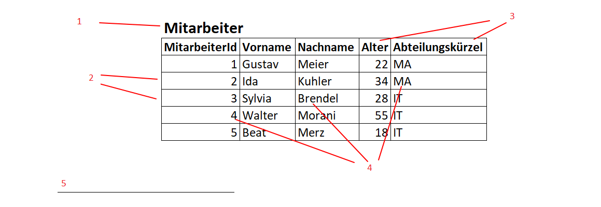

# Theorie

- SQL select, insert

- DDL/DML/DQL

DDL – Data Definition Language = Hiermit erstellst oder löschst du Tabellen und definierst Datentypen.

DML – Data Manipulation Language = Die Arbeit mit den eigentlichen Inhalten (den Datensätzen). Hiermit veränderst du, was in den Tabellen steht.

DQL – Data Query Language = Das Abfragen und Lesen von Daten.

- Theorie zu Datenbankeinsatz

- Beziehungen
  1:1,
  1:n,
  n:m

- Entitäten = Tabellen

- Fachliche Begriffe
  

1. Tabellennamen
2. Zeile / Datensatz / Tupel
3. Spalte / Attribut / Feld
4. Datenwert / Attributwert
5. Primärschlüssel

# Praxis

- DDL/DML - Befehle
- DUMP
- Skript muss 2x laufen können (mit Drop am anfang)
